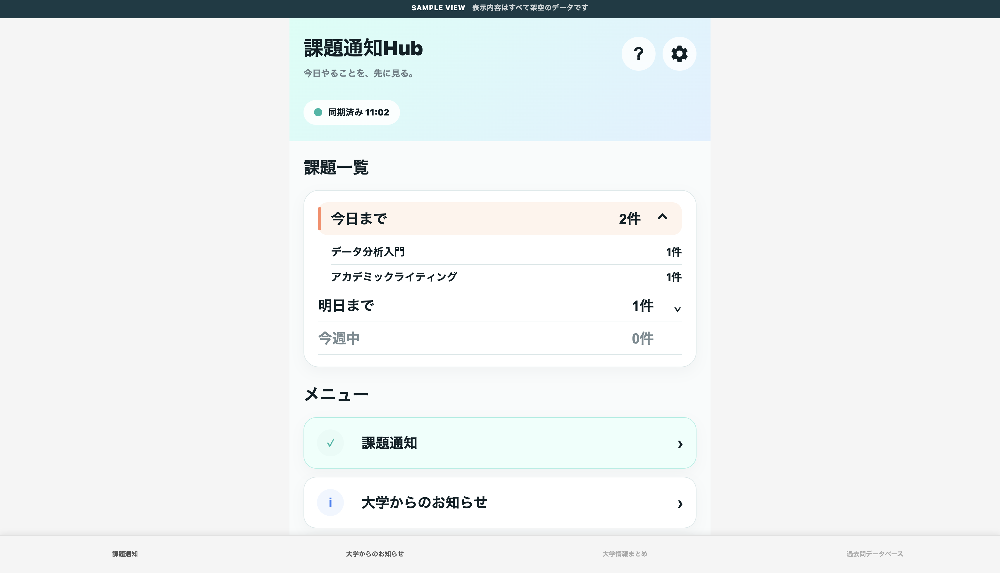
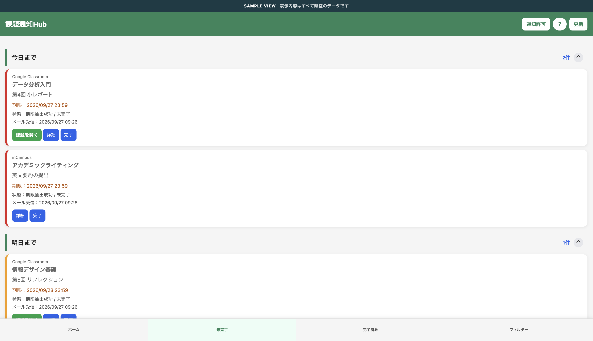
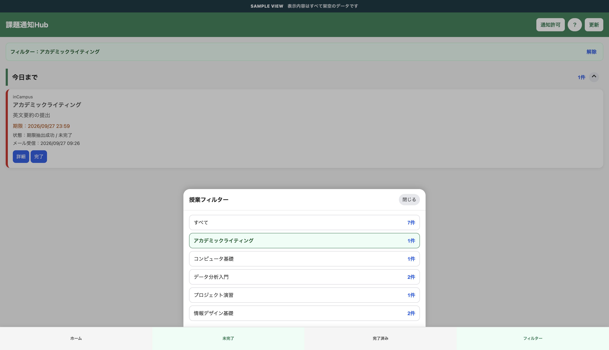
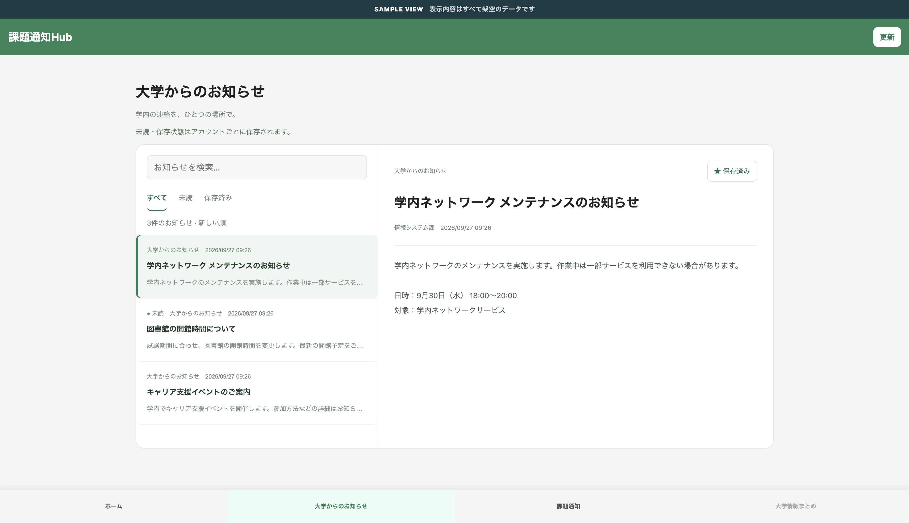
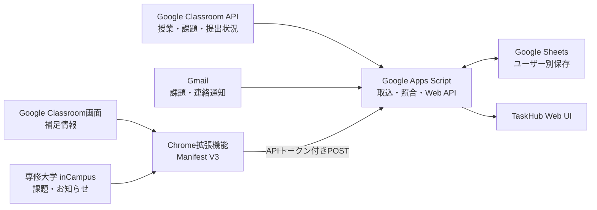

# 課題通知Hub

Google Classroomの授業・課題・本人の提出状況をClassroom APIから取得し、Gmail通知とinCampusのお知らせをまとめて確認するWebアプリです。Classroom APIの課題情報を基準にし、Gmailを短い間隔で取り込んで通知内容やAPIにない情報を補います。inCampus通知と拡張機能の抽出結果は厳密に照合して表示します。データは利用者ごとのGoogleスプレッドシートに保存します。

個人開発を主体としたプロジェクトで、一部のUI・ホーム画面のデザインは共同で検討・制作しています。専修大学、Googleの公式サービスではありません。inCampus連携は専修大学の環境を対象としています。

## 画面例

表示データはすべて架空のサンプルです。

<table>
  <tr>
    <td></td>
    <td></td>
  </tr>
  <tr>
    <td></td>
    <td></td>
  </tr>
</table>

## 開発背景

課題や大学からの連絡はGoogle Classroom、inCampus、Gmailに分かれて届きます。TaskHubはClassroom APIから取得した課題と本人の提出状態を基準に一覧を作り、Gmailの通知やブラウザー拡張機能から得た情報を照合して、締切順に確認できるようにします。

## 主な機能

- Google ClassroomとinCampusの課題通知を締切の近い順に表示
- Classroom APIから授業・公開課題・本人の提出状況を1時間ごとに同期
- Gmailを15分ごとに同期し、Classroom課題メールやAPIにない通知を補足
- 手動更新ではClassroom APIの後にGmailを同期し、画面を保ったまま結果を表示
- 同じ課題をAPIとGmailの両方で取得した場合は一つにまとめ、APIの締切・提出状態とGmailの受信日時・元メールを保持
- API定期同期時に期限後14日、または期限なしで配信後21日を過ぎた課題を整理
- `授業`、`Classroom課題`、`inCampus通知`、`提出状況`、`補足通知`の5シートに保存
- 期限区分、授業別フィルター、未完了・完了済みの切り替え
- 課題の詳細表示、元の課題ページへの移動、完了状態の管理
- 新しい課題のブラウザー通知
- Chrome拡張機能を使ったClassroom・inCampus画面の補足同期
- 大学からのお知らせの検索、未読・保存済みの絞り込み
- 架空データのテストケースと、今日・明日・今週・来週・年末年始・閏日などの仮想日時
- スマートフォン幅に対応した画面表示

## 技術スタック

| 分類 | 技術 |
| --- | --- |
| Webアプリ・サーバー処理 | Google Apps Script |
| フロントエンド | HTML、CSS、JavaScript |
| ブラウザー拡張 | Chrome Extension、Manifest V3、Chrome Extension APIs |
| Classroomの授業・課題・提出状況 | Google Classroom API |
| Gmail通知 | Gmail、GmailApp |
| ユーザー別データ保存 | Google Sheets |
| 外部画面との連携 | Google Classroom、専修大学 inCampus |

## システム構成



## データソースの役割

TaskHubでは、Google Classroom API、Gmail、Chrome拡張機能を同じ用途で重複利用するのではなく、それぞれの特徴に合わせて役割を分けています。

| 情報 | 基準とするデータソース | 補足 |
| --- | --- | --- |
| Classroomの授業ID・課題ID | Google Classroom API | 課題照合の基準として使用 |
| Classroom課題名・説明・正式な締切 | Google Classroom API | APIから取得した現在値を基準にする |
| Classroomの提出状態・遅延・公開済み点数 | Google Classroom API | 利用者本人の提出情報のみ取得 |
| Classroom課題メールの受信日時 | Gmail | APIにはない通知時刻として保持 |
| Gmailの元メール・メッセージID | Gmail | API課題と一致した場合も削除せず保持 |
| Classroomのお知らせ・資料・返却通知 | Gmail | APIの課題一覧だけでは取得できない情報を補完 |
| APIにまだ反映されていない新着Classroom課題 | Gmail | 15分同期で先に表示し、後続のAPI同期で照合 |
| inCampus通知 | Gmail | inCampusのメール転送機能を利用 |
| inCampus課題の詳細情報 | Chrome拡張機能 | ログイン済み画面から補足情報を抽出 |

Classroom課題ではGoogle Classroom APIを基準データとし、同じ課題のGmail通知は別カードとして重複表示せず、一つの課題カードへ統合します。

Gmailは15分ごと、Classroom APIは1時間ごとに同期します。Gmailで新しい課題通知を先に取得した場合は、API同期前でも大まかな情報を表示できます。その後APIで同じ課題を取得できた場合は、APIの締切・提出状態などを優先しつつ、Gmailの受信日時・メッセージID・元メールへのリンクを保持します。

APIとGmailで一意に同じ課題と確認できない場合は、無理に統合しません。

## 設計・実装上の工夫

### Classroom APIを基準にした課題情報の統合

Classroom APIから取得した課題の締切と本人の提出状態を課題カードの基準にします。同じ課題のGmail通知はカードに統合し、メールID・受信日時・元メールへのリンクを保持します。APIで確認できない通知や、まだAPIに現れていない課題メールは補足通知として扱います。

### 曖昧な照合では状態を変更しない

Classroom APIの授業ID・課題IDや課題URLを使って照合します。inCampus抽出結果は授業名・課題名・レポートURLが一意に一致した時だけGmail通知と結び付けます。曖昧な一致では締切や完了状態を変更しません。

### 日本時間の締切と保存期間

Classroom APIの締切は日本時間へ変換して扱います。APIから日付だけが返る場合は23:59を使用します。期限がある課題は期限後14日、期限なしの課題は配信から21日後に整理します。この削除処理は1時間ごとの定期API同期で行い、手動更新や保存先Excelの作成では実行しません。

### APIとGmailを異なる周期で同期

Classroom APIとGmailでは、取得できる情報と処理時間が異なるため、同じ周期では同期していません。

- Gmail：15分ごと
- Classroom API：1時間ごと
- 手動更新：Classroom APIを先に同期し、その後Gmailを同期

Gmailは比較的短い周期で新着通知を取得し、新しい課題を早く表示するために使います。

Classroom APIはGmailより同期周期を長くし、課題の正式な締切、現在の提出状態、課題IDなどの構造化された情報を取得して、保存済みデータを補正・確定します。

この構成により、更新速度だけを優先してAPIを高頻度で呼び出すことを避けつつ、Gmailだけでは取得できない正確な課題状態も維持します。

### 同期失敗時に既存データを壊さない

Classroom APIの取得途中でエラーやタイムアウトが発生した場合は、途中まで取得できたデータで保存済みのClassroom課題一覧を置き換えません。

API同期とGmail同期は分離しており、手動更新時にClassroom API側でエラーが発生しても、可能な場合はGmail同期を続行します。

また、Gmailから先に取得したClassroom課題はAPI同期前でも保持します。後続のAPI同期で同じ課題を確認できた場合に統合し、APIに存在しないGmail通知やお知らせはそのまま残します。

Classroom APIの課題一覧が0件になった場合も、それだけで正常な空一覧とは判断せず、取得処理が正常に完了したかを確認してから保存内容を更新します。

### Gmailを短い間隔で取り込む

Gmailは15分間隔で取得します。新しく作る保存先では初回に過去20日分を取り込み、その後は保存済み受信日時を基準に新着分を検索します。手動更新ではClassroom APIを先に同期し、その後Gmailを処理します。

### 非同期更新による状態競合への対策

完了・未完了の操作中に古い一覧取得が返っても、新しい状態を上書きしにくいよう、リクエストIDと状態世代を管理しています。更新が落ち着いた後に一覧を再取得し、保存状態と表示を合わせます。

### 同期失敗を成功扱いしない

Classroomの読み込み途中やタイムアウトを「0件の同期成功」と判定しないよう、実際のページURLや課題一覧の状態を確認します。大量の同期データは件数と本文サイズに応じて分割し、一部の送信失敗も結果に残します。

### ユーザー単位の保存とAPI保護

WebアプリはアクセスしているGoogleアカウントとして実行し、そのアカウントのスプレッドシートへ保存します。Chrome拡張機能からのPOSTには利用者ごとのAPIトークンを使い、トークンをURLに含めません。提出回答本文や提出ファイルは保存せず、公開された点数と提出状態だけを扱います。

## 使用するGoogle権限

TaskHubは必要なGoogleサービスへアクセスするため、利用者本人のGoogleアカウントで権限を承認して使用します。

| 権限 | 用途 |
| --- | --- |
| `classroom.courses.readonly` | 利用者本人が参加しているClassroom授業の取得 |
| `classroom.coursework.me.readonly` | Classroom課題と本人の提出状態の取得 |
| `classroom.rosters.readonly` | Classroomの利用者・授業情報の確認 |
| `classroom.topics.readonly` | Classroom課題のトピック情報の取得 |
| `gmail.readonly` | Classroom・inCampusから届いた通知メールの読み取り |
| `spreadsheets` | 利用者ごとの保存用Googleスプレッドシートの作成・更新 |
| `script.scriptapp` | Gmail・Classroom APIの定期同期トリガーの作成・管理 |

Classroom関連の権限は読み取り専用です。TaskHubからGoogle Classroom上の課題、提出物、授業内容を変更することはありません。

Gmailも読み取り専用で利用し、メールの送信・削除・変更は行いません。

提出回答本文や提出ファイルそのものは保存せず、TaskHubで必要な課題情報、提出状態、公開済み点数などだけを保存します。

## セキュリティとデータの扱い

- 本番デプロイは「アクセスしているユーザーとして実行」し、専修大学のGoogleアカウントだけに制限しています。各利用者が自分のGoogle権限を承認します。
- Chrome拡張機能は、同期時にログイン済みのClassroom・inCampus画面を読み取ります。各サービスへのログインが必要です。
- `.clasp.json`、APIトークン、実際の課題・メールデータは公開リポジトリに含めません。
- テストExcelとサンプル画面は架空のデータを使い、テストリンクには`.invalid`ドメインを使います。

## 制約

- inCampus連携は専修大学の環境を対象としています。
- inCampusやGoogle Classroomの画面構造が変わると、Chrome拡張機能の抽出処理を修正する必要が生じる場合があります。
- Classroom APIは利用者本人が参加する授業と本人の提出情報を取得します。拡張機能で画面情報を補う場合は、ChromeでClassroomまたはinCampusへログインしてください。
- 本プロジェクトは専修大学・Googleによる公式サービスではありません。
- Classroom APIによる課題取得が一時的に失敗した場合は、保存済みデータとGmail由来の情報を利用します。APIが長期間利用できない場合、一部の最新状態が反映されるまで時間がかかる場合があります。

## 設計の変遷

TaskHubは最初から現在の構成だったわけではなく、実際に利用しながらデータ取得方法を段階的に変更しています。

### 1. Gmailによる通知統合

初期版では、Google ClassroomとinCampusの通知をGmailへ集約し、Google Apps Scriptでメールを取得・解析する方式から開始しました。

この方式により、Google ClassroomとinCampusという異なるシステムを、Gmailという共通の入力元から扱えるようにしました。

### 2. Chrome拡張機能による不足情報の補完

Gmail通知だけでは取得できない期限時刻、提出状態、inCampus課題の詳細情報を補うため、Chrome拡張機能を追加しました。

拡張機能はログイン済みのGoogle Classroom・inCampus画面を読み取り、Gmailで保存済みの通知と一意に照合できる場合だけ情報を補完します。

### 3. テスト基盤と増分同期の整備

機能追加に伴って処理量と回帰リスクが増えたため、架空データを使った回帰テスト、仮想日時、Gmailの増分同期、Apps Scriptの機能別ファイル分割を追加しました。

実際のGmailやGoogle Drive、本番スプレッドシートへ接続せず、期限境界、年末年始、閏日、重複・誤照合、完了状態などをローカルで確認できるようにしています。

### 4. Classroom APIとGmailの併用

Classroom APIが利用可能であることを検証した後、Classroom課題の基準データをGmailからClassroom APIへ移しました。

現在は、Classroom APIから授業・課題・本人の提出状態を取得し、Gmailを新着通知の早期取得とAPIにない情報の補完に利用しています。

Gmailを廃止するのではなく、

- Classroom API：正確な現在状態
- Gmail：短周期の新着通知と通知履歴
- Chrome拡張機能：画面上にしかない補足情報

という役割分担にしています。

この変更により、初期のGmail中心の構成で作成した通知取得・増分同期・テスト基盤を維持しながら、Classroom課題の正確性を高めています。

## ファイル構成

- [Apps Script Webアプリ本体](./課題hub/taskhub-split/taskhub-split/)
- [本体ソースのworkspaceミラー](./課題hub/taskhub-split/workspace/taskhub-split/)
- [Chrome拡張機能 v2.5.8](./課題hub/taskhub-extension-v2.5/)
- [Gmail通知と拡張機能データの照合仕様](./課題hub/taskhub-split/taskhub-split/MAIL_LINKING.md)
- [保存期間・状態管理・移行時の注意](./課題hub/taskhub-split/taskhub-split/STORAGE.md)
- [Classroom API検証プロジェクトと専用テスト](./課題hub/taskhub-split/classroom-api-experiment/README.md)
- [回帰テスト用Excel](./課題hub/test-fixtures/TaskHub-test-cases.xlsx)
- [ローカル開発とApps Script更新手順](./課題hub/README.md)
- [拡張機能の導入・設定方法](./課題hub/taskhub-extension-v2.5/README.md)
- [開発・改修履歴](./CHANGELOG.md)

Apps Scriptサーバーは `Code.gs` に共有設定と入口を置き、メール同期・通知解析・一覧処理・拡張機能連携を機能別の `.gs` ファイルに分けています。画面側も `Scripts*.html` と `Styles*.html` に分け、`Index.html` が読み込み順を管理します。

## セットアップ概要

1. Apps Script Webアプリ本体のファイルをApps Scriptプロジェクトへ反映し、Webアプリとしてデプロイします。
2. データを利用者ごとに分ける場合は、Webアプリの実行ユーザーを「アクセスしているユーザー」に設定します。
3. Chromeで拡張機能フォルダーを「パッケージ化されていない拡張機能」として読み込みます。
4. 拡張機能に自分のWebアプリURLと、本体のセキュリティ設定で発行したAPIトークンを設定します。
5. 各自のGoogleアカウントとClassroom・inCampusへログインし、必要な権限を承認して使用します。

詳しい導入手順と対応範囲は[拡張機能README](./課題hub/taskhub-extension-v2.5/README.md)を参照してください。

## ローカル回帰テスト

Apps Scriptの実コードとブラウザー拡張機能の回帰テストは、`課題hub/` で次のコマンドを実行します。

```sh
cd 課題hub
pnpm install --frozen-lockfile
pnpm test
```

テストは期限区分、土日・週境界、月末・年末、閏日、日付なしや0:00の締切、複数課題を含むメール、重複・誤照合、APIとGmailの統合、完了状態、設定切替、非同期更新を確認します。`課題hub/test-fixtures/TaskHub-test-cases.xlsx` とテストメールの値はすべて架空で、リンクには予約済みの`.invalid`ドメインを使います。個人の保存データ、Gmail、Google Drive、本番シートには接続しません。

`pnpm test` はApps Script本体、拡張機能、画面のオフライン回帰テストを実行します。Excelを実際に読み込む追加スモークテストには `@oai/artifact-tool` が必要です。利用できない環境ではExcelスモークのみスキップされます。ブラウザーでローカル画面を試す手順は[ローカル起動ガイド](./課題hub/local-dev/README.md)にあります。
