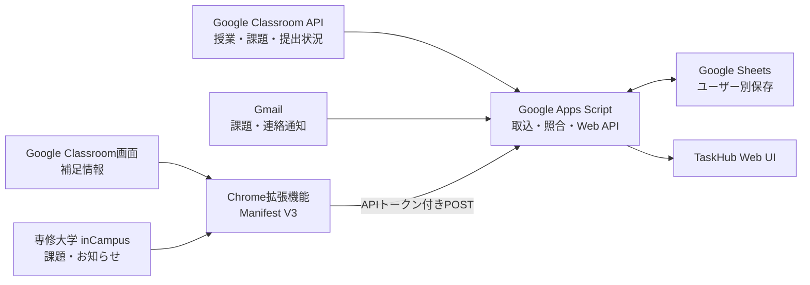

# 課題通知Hub

Google Classroomの授業・課題・本人の提出状況をClassroom APIから取得し、Gmail通知とinCampusのお知らせをまとめて確認するWebアプリです。Classroom APIの課題情報を基準にし、Gmailを短い間隔で取り込んで通知内容やAPIにない情報を補います。inCampus通知と拡張機能の抽出結果は厳密に照合して表示します。データは利用者ごとのGoogleスプレッドシートに保存します。

個人開発を主体としたプロジェクトで、一部のUI・ホーム画面のデザインは共同で検討・制作しています。専修大学、Googleの公式サービスではありません。inCampus連携は専修大学の環境を対象としています。

## 画面例

表示データはすべて架空のサンプルです。

<table>
  <tr>
    <td></td>
    <td></td>
  </tr>
  <tr>
    <td></td>
    <td></td>
  </tr>
</table>

## 開発背景

課題や大学からの連絡はGoogle Classroom、inCampus、Gmailに分かれて届きます。TaskHubはClassroom APIから取得した課題と本人の提出状態を基準に一覧を作り、Gmailの通知やブラウザー拡張機能から得た情報を照合して、締切順に確認できるようにします。

## 主な機能

- Google ClassroomとinCampusの課題通知を締切の近い順に表示
- Classroom APIから授業・公開課題・本人の提出状況を1時間ごとに同期
- Gmailを15分ごとに同期し、Classroom課題メールやAPIにない通知を補足
- 手動更新ではClassroom APIの後にGmailを同期し、画面を保ったまま結果を表示
- 同じ課題をAPIとGmailの両方で取得した場合は一つにまとめ、APIの締切・提出状態とGmailの受信日時・元メールを保持
- API定期同期時に期限後14日、または期限なしで配信後21日を過ぎた課題を整理
- `授業`、`Classroom課題`、`inCampus通知`、`提出状況`、`補足通知`の5シートに保存
- 期限区分、授業別フィルター、未完了・完了済みの切り替え
- 課題の詳細表示、元の課題ページへの移動、完了状態の管理
- 新しい課題のブラウザー通知
- Chrome拡張機能を使ったClassroom・inCampus画面の補足同期
- 大学からのお知らせの検索、未読・保存済みの絞り込み
- 架空データのテストケースと、今日・明日・今週・来週・年末年始・閏日などの仮想日時
- スマートフォン幅に対応した画面表示

## 技術スタック

| 分類 | 技術 |
| --- | --- |
| Webアプリ・サーバー処理 | Google Apps Script |
| フロントエンド | HTML、CSS、JavaScript |
| ブラウザー拡張 | Chrome Extension、Manifest V3、Chrome Extension APIs |
| Classroomの授業・課題・提出状況 | Google Classroom API |
| Gmail通知 | Gmail、GmailApp |
| ユーザー別データ保存 | Google Sheets |
| 外部画面との連携 | Google Classroom、専修大学 inCampus |

## システム構成



## 設計・実装上の工夫

### Classroom APIを基準にした課題情報の統合

Classroom APIから取得した課題の締切と本人の提出状態を課題カードの基準にします。同じ課題のGmail通知はカードに統合し、メールID・受信日時・元メールへのリンクを保持します。APIで確認できない通知や、まだAPIに現れていない課題メールは補足通知として扱います。

### 曖昧な照合では状態を変更しない

Classroom APIの授業ID・課題IDや課題URLを使って照合します。inCampus抽出結果は授業名・課題名・レポートURLが一意に一致した時だけGmail通知と結び付けます。曖昧な一致では締切や完了状態を変更しません。

### 日本時間の締切と保存期間

Classroom APIの締切は日本時間へ変換して扱います。APIから日付だけが返る場合は23:59を使用します。期限がある課題は期限後14日、期限なしの課題は配信から21日後に整理します。この削除処理は1時間ごとの定期API同期で行い、手動更新や保存先Excelの作成では実行しません。

### Gmailを短い間隔で取り込む

Gmailは15分間隔で取得します。新しく作る保存先では初回に過去20日分を取り込み、その後は保存済み受信日時を基準に新着分を検索します。手動更新ではClassroom APIを先に同期し、その後Gmailを処理します。

### 非同期更新による状態競合への対策

完了・未完了の操作中に古い一覧取得が返っても、新しい状態を上書きしにくいよう、リクエストIDと状態世代を管理しています。更新が落ち着いた後に一覧を再取得し、保存状態と表示を合わせます。

### 同期失敗を成功扱いしない

Classroomの読み込み途中やタイムアウトを「0件の同期成功」と判定しないよう、実際のページURLや課題一覧の状態を確認します。大量の同期データは件数と本文サイズに応じて分割し、一部の送信失敗も結果に残します。

### ユーザー単位の保存とAPI保護

WebアプリはアクセスしているGoogleアカウントとして実行し、そのアカウントのスプレッドシートへ保存します。Chrome拡張機能からのPOSTには利用者ごとのAPIトークンを使い、トークンをURLに含めません。提出回答本文や提出ファイルは保存せず、公開された点数と提出状態だけを扱います。

## セキュリティとデータの扱い

- 本番デプロイは「アクセスしているユーザーとして実行」し、専修大学のGoogleアカウントだけに制限しています。各利用者が自分のGoogle権限を承認します。
- Chrome拡張機能は、同期時にログイン済みのClassroom・inCampus画面を読み取ります。各サービスへのログインが必要です。
- `.clasp.json`、APIトークン、実際の課題・メールデータは公開リポジトリに含めません。
- テストExcelとサンプル画面は架空のデータを使い、テストリンクには`.invalid`ドメインを使います。

## 制約

- inCampus連携は専修大学の環境を対象としています。
- inCampusやGoogle Classroomの画面構造が変わると、Chrome拡張機能の抽出処理を修正する必要が生じる場合があります。
- Classroom APIは利用者本人が参加する授業と本人の提出情報を取得します。拡張機能で画面情報を補う場合は、ChromeでClassroomまたはinCampusへログインしてください。
- 本プロジェクトは専修大学・Googleによる公式サービスではありません。

## ファイル構成

- [Apps Script Webアプリ本体](./課題hub/taskhub-split/taskhub-split/)
- [本体ソースのworkspaceミラー](./課題hub/taskhub-split/workspace/taskhub-split/)
- [Chrome拡張機能 v2.5.8](./課題hub/taskhub-extension-v2.5/)
- [Gmail通知と拡張機能データの照合仕様](./課題hub/taskhub-split/taskhub-split/MAIL_LINKING.md)
- [保存期間・状態管理・移行時の注意](./課題hub/taskhub-split/taskhub-split/STORAGE.md)
- [Classroom API検証プロジェクトと専用テスト](./課題hub/taskhub-split/classroom-api-experiment/README.md)
- [回帰テスト用Excel](./課題hub/test-fixtures/TaskHub-test-cases.xlsx)
- [ローカル開発とApps Script更新手順](./課題hub/README.md)
- [拡張機能の導入・設定方法](./課題hub/taskhub-extension-v2.5/README.md)
- [開発・改修履歴](./CHANGELOG.md)

Apps Scriptサーバーは `Code.gs` に共有設定と入口を置き、メール同期・通知解析・一覧処理・拡張機能連携を機能別の `.gs` ファイルに分けています。画面側も `Scripts*.html` と `Styles*.html` に分け、`Index.html` が読み込み順を管理します。

## セットアップ概要

1. Apps Script Webアプリ本体のファイルをApps Scriptプロジェクトへ反映し、Webアプリとしてデプロイします。
2. データを利用者ごとに分ける場合は、Webアプリの実行ユーザーを「アクセスしているユーザー」に設定します。
3. Chromeで拡張機能フォルダーを「パッケージ化されていない拡張機能」として読み込みます。
4. 拡張機能に自分のWebアプリURLと、本体のセキュリティ設定で発行したAPIトークンを設定します。
5. 各自のGoogleアカウントとClassroom・inCampusへログインし、必要な権限を承認して使用します。

詳しい導入手順と対応範囲は[拡張機能README](./課題hub/taskhub-extension-v2.5/README.md)を参照してください。

## ローカル回帰テスト

Apps Scriptの実コードとブラウザー拡張機能の回帰テストは、`課題hub/` で次のコマンドを実行します。

```sh
cd 課題hub
pnpm install --frozen-lockfile
pnpm test
```

テストは期限区分、土日・週境界、月末・年末、閏日、日付なしや0:00の締切、複数課題を含むメール、重複・誤照合、APIとGmailの統合、完了状態、設定切替、非同期更新を確認します。`課題hub/test-fixtures/TaskHub-test-cases.xlsx` とテストメールの値はすべて架空で、リンクには予約済みの`.invalid`ドメインを使います。個人の保存データ、Gmail、Google Drive、本番シートには接続しません。

`pnpm test` はApps Script本体、拡張機能、画面のオフライン回帰テストを実行します。Excelを実際に読み込む追加スモークテストには `@oai/artifact-tool` が必要です。利用できない環境ではExcelスモークのみスキップされます。ブラウザーでローカル画面を試す手順は[ローカル起動ガイド](./課題hub/local-dev/README.md)にあります。
