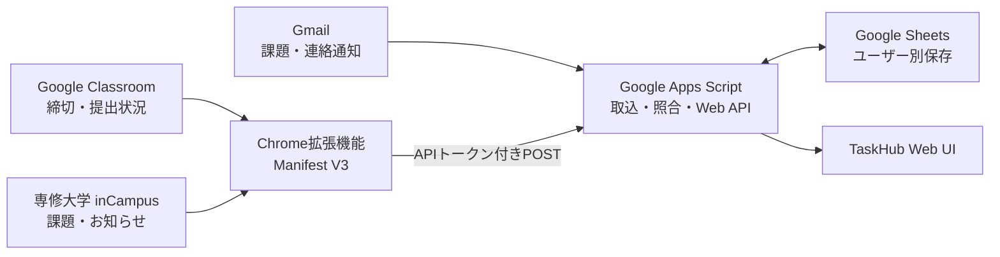

# 課題通知Hub

Google Classroomや専修大学のinCampusから届く課題・連絡をまとめ、締切と対応状況を確認するWebアプリです。Gmailの通知をGoogle Apps Scriptで取り込み、Googleスプレッドシートに保存します。Chrome拡張機能を使うと、ログイン中のClassroomやinCampusから締切時刻・提出状況などを補えます。

個人開発のプロジェクトです。専修大学、Googleの公式サービスではありません。inCampus連携は専修大学の環境を対象としています。

## 画面例

表示データはすべて架空のサンプルです。

<table>
  <tr>
    <td></td>
    <td></td>
  </tr>
  <tr>
    <td></td>
    <td></td>
  </tr>
</table>

## 開発背景

課題や大学からの連絡はGoogle Classroom、inCampus、Gmailに分かれて届きます。TaskHubは、通知を締切順にまとめ、完了状態や授業別の一覧と合わせて確認できるようにするために開発しました。Gmailの通知を保存・照合の基準にし、ClassroomやinCampusの画面から取得した情報で不足する締切や提出状況を補います。

## 主な機能

- Google ClassroomとinCampusの課題通知を締切の近い順に表示
- 期限区分、授業別フィルター、未完了・完了済みの切り替え
- 課題の詳細表示、元の課題ページへの移動、完了状態の管理
- 新しい課題のブラウザー通知
- Chrome拡張機能を使ったClassroomの締切・提出状況の同期
- 大学からのお知らせの検索、未読・保存済みの絞り込み
- スマートフォン幅に対応した画面表示

## 技術スタック

| 分類 | 技術 |
| --- | --- |
| Webアプリ・サーバー処理 | Google Apps Script |
| フロントエンド | HTML、CSS、JavaScript |
| ブラウザー拡張 | Chrome Extension、Manifest V3、Chrome Extension APIs |
| メール・課題通知 | Gmail、GmailApp |
| ユーザー別データ保存 | Google Sheets |
| 外部画面との連携 | Google Classroom、専修大学 inCampus |

## システム構成

## 設計・実装上の工夫

### Gmail通知を基準にした情報統合

Gmailに保存された通知を基準データとして扱い、ClassroomやinCampusから取得した情報は補足として照合します。画面上で抽出できたという理由だけで新規課題を作らず、対応する保存済み通知を確認してから統合することで、誤登録や二重表示を抑えています。

### 曖昧な照合では状態を変更しない

ClassroomのURLやコース・課題IDなどを使って既存通知と照合します。既存行と結び付けられない課題は未一致として扱い、完了状態や締切を別の課題へ誤って反映しないようにしています。inCampusの提出記録も課題詳細データと分けて扱います。

### 非同期更新による状態競合への対策

完了・未完了の操作中に古い一覧取得が返っても、新しい状態を上書きしにくいよう、リクエストIDと状態世代を管理しています。更新が落ち着いた後に一覧を再取得し、保存状態と表示を合わせます。

### 同期失敗を成功扱いしない

Classroomの読み込み途中やタイムアウトを「0件の同期成功」と判定しないよう、実際のページURLや課題一覧の状態を確認します。大量の同期データは件数と本文サイズに応じて分割し、一部の送信失敗も結果に残します。

### ユーザー単位の保存とAPI保護

利用者本人としてWebアプリを実行する設定では、データをアクセスしたGoogleアカウントごとのスプレッドシートに保存します。Chrome拡張機能からのPOSTにはAPIトークンを使い、トークンをURLに含めません。受信本文・レコード数・各項目の長さを制限し、URL検証やスプレッドシート数式として解釈される入力への対策も行っています。

## セキュリティとデータの扱い

- 利用者ごとにデータを分けるには、Apps Script Webアプリを「アクセスしているユーザーとして実行」する必要があります。デプロイ設定によって保存先やGmailへのアクセス主体が変わるため、共有前に設定を確認してください。
- Chrome拡張機能は、同期時にログイン済みのClassroom・inCampus画面を読み取ります。各サービスへのログインが必要です。
- APIトークンや実際の課題・メールデータを、公開リポジトリやスクリーンショットに含めないでください。
- このリポジトリのサンプル画面には架空のデータを使用しています。

## 制約

- inCampus連携は専修大学の環境を対象としています。
- inCampusやGoogle Classroomの画面構造が変わると、Chrome拡張機能の抽出処理を修正する必要が生じる場合があります。
- Classroom・inCampusからの同期には、対象サービスへログインしたChromeと拡張機能の設定が必要です。
- 本プロジェクトは専修大学・Googleによる公式サービスではありません。

## ファイル構成

- [Apps Script Webアプリ本体](./課題hub/taskhub-split/taskhub-split/)
- [本体ソースのworkspaceミラー](./課題hub/taskhub-split/workspace/taskhub-split/)
- [Chrome拡張機能 v2.5.8](./課題hub/taskhub-extension-v2.5/)
- [Gmail通知と拡張機能データの照合仕様](./課題hub/taskhub-split/taskhub-split/MAIL_LINKING.md)
- [保存期間・状態管理・移行時の注意](./課題hub/taskhub-split/taskhub-split/STORAGE.md)
- [拡張機能の導入・設定方法](./課題hub/taskhub-extension-v2.5/README.md)
- [開発・改修履歴](./CHANGELOG.md)

## セットアップ概要

1. Apps Script Webアプリ本体のファイルをApps Scriptプロジェクトへ反映し、Webアプリとしてデプロイします。
2. データを利用者ごとに分ける場合は、Webアプリの実行ユーザーを「アクセスしているユーザー」に設定します。
3. Chromeで拡張機能フォルダーを「パッケージ化されていない拡張機能」として読み込みます。
4. 拡張機能に自分のWebアプリURLと、本体のセキュリティ設定で発行したAPIトークンを設定します。
5. 各自のGoogleアカウントとClassroom・inCampusへログインし、必要な権限を承認して使用します。

詳しい導入手順と対応範囲は[拡張機能README](./課題hub/taskhub-extension-v2.5/README.md)を参照してください。
