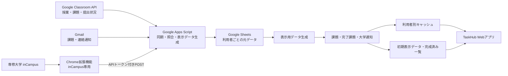

# 課題通知Hub

**TaskHub for Senshu University**

> 個人開発を主体としたプロジェクトで、一部のUI・ホーム画面のデザインは共同で検討・制作しています。専修大学、Googleの公式サービスではありません。inCampus連携は専修大学の環境を対象としています。

[TaskHubを開く](https://script.google.com/a/macros/senshu-u.jp/s/AKfycbxhoMvz2hSAAzIwWQ6YSwGWJwvzjRdDYpPxyaKQ2y9Bqigjw6YYwxSwbC6s4iHAaz4Q/exec)

Classroom、inCampus、Gmailに分散して届く課題と通知を、利用者ごとのWeb画面にまとめます。Classroomの課題・提出状況はGoogle Classroom APIを基準にし、GmailとinCampusは先行通知や補足情報に使います。

## 画面例

下の画面例はすべて架空のサンプルデータです。

<table>
  <tr>
    <td></td>
    <td></td>
  </tr>
  <tr>
    <td></td>
    <td></td>
  </tr>
</table>

## 何を解決するか

授業・課題・大学からの連絡が複数のサービスに分かれていると、締切や提出状況を確認するために各サービスを行き来する必要があります。TaskHubは、それらを一画面で確認し、同じ課題の重複表示や不確かな照合による状態の誤変更を避けることを目的としています。

現在の対象は、専修大学のGoogleアカウントとinCampus環境です。

## すぐに使う

1. [本番Webアプリ](https://script.google.com/a/macros/senshu-u.jp/s/AKfycbxhoMvz2hSAAzIwWQ6YSwGWJwvzjRdDYpPxyaKQ2y9Bqigjw6YYwxSwbC6s4iHAaz4Q/exec)を開き、専修大学のGoogleアカウントで必要なGoogle権限を承認します。
2. 初回の保存先準備とClassroom・Gmail同期が完了するまで待ちます。途中で失敗した場合は完了扱いにせず、再試行できる状態を保ちます。
3. inCampusの課題詳細や通知も取り込みたい場合は、[Chrome拡張機能 v2.5.16](./taskhub-extension-v2.5/README.md)を追加して、本番WebアプリURLとHubで発行したAPIトークンを登録します。

通常利用者がApps Scriptプロジェクトを作成したり、ソースを貼り付けてデプロイしたりする必要はありません。

## 主な機能

- Google Classroomの課題、締切、本人の提出状況、公開済み点数の表示
- GmailのClassroom・inCampus通知と大学からのお知らせの補完
- inCampusの課題詳細、お知らせ、提出通知の取り込み
- 未完了・完了の切り替え、締切別グループ、授業別フィルター
- 大学からのお知らせの検索、未読・保存済み絞り込み
- 新着課題のブラウザー通知と元サービスへのリンク
- 利用者ごとの保存先と表示状態の分離
- 同期時に準備した一覧、初期表示データ、完成済み全件一覧を使った画面表示

## データソースの役割

| 情報 | 基準とするデータソース | TaskHubでの使い方 |
| --- | --- | --- |
| Classroomの授業ID・課題ID | Google Classroom API | 課題照合の識別子 |
| Classroomの課題名・説明・正式な締切 | Google Classroom API | 課題の現在値 |
| Classroomの提出状態・遅延・返却・公開済み点数 | Google Classroom API | 本人の提出状況 |
| Classroom課題メールの受信日時・元メール | Gmail | 通知時刻やメールへの導線 |
| API反映前の新着課題通知 | Gmail | 次回API同期前の先行表示 |
| Classroomのお知らせ・資料・返却通知 | Gmail | APIの課題一覧にない補足通知 |
| inCampus通知メール | Gmail | inCampus由来の通知 |
| inCampusの課題詳細・お知らせ・提出通知 | Chrome拡張機能 | ログイン済みinCampus画面から取得 |

同じClassroom課題がAPIとGmailの両方にある場合は、課題ID・授業ID・URLなどで一意に照合できた時だけ統合します。Classroomの正式な締切や提出状態はAPI側を基準にし、Gmailの受信時刻と元メールへのリンクを保持します。曖昧な照合では締切や完了状態を推測で変更せず、別データとして扱います。

GmailはClassroom APIを置き換える正本ではなく、新着の先行通知やAPIから取得できない連絡を補います。inCampusの表示内容は、大学から実際に届いたGmail通知と、ログイン済み画面から拡張機能が取得した内容を区別して扱います。

## システム構成

Chrome拡張機能はinCampus専用です。Google Classroomの画面、期限、完了状態は読み取りません。Classroom連携はWebアプリ本体のGoogle Classroom APIとGmail同期が担当します。

## 同期と表示

通常の画面表示では、毎回GmailやClassroom APIを呼び出して同期しません。定期同期または利用者の手動同期で元データを更新し、そのタイミングで画面向けの表示データも準備します。

代表的な表示用シートは次の3つです。

- 課題表示データ
- 完了課題表示データ
- 大学通知表示データ

これらは元データから再生成できる派生データです。画面では利用者別キャッシュや準備済みシートを読み、起動直後に必要な集計・先頭カードは初期HTMLにも埋め込みます。

課題と大学通知の軽量な全件一覧は圧縮した完成済みスナップショットとして保存します。A/Bの保存先を交互に使い、新しい一覧を書き終えて検証するまで旧世代を公開状態に保ちます。同期中または保存失敗時に途中までの一覧を公開せず、新しいスナップショットを作れない場合は直前の完成済み一覧を維持します。容量条件を満たさない場合は通常のシート読込へ戻ります。

表示内容に変化がなければ表示用シートへの再書き込みを省きます。inCampusだけが更新された保存では、同期時に準備したClassroom由来の表示入力を条件付きで再利用します。欠落・破損・世代不一致・同期中・容量超過などを検出した場合は再利用せず、通常のシート読込へ戻します。

大学通知は一覧用の軽量情報を先に読み、本文は通知を選んだ時に取得します。本文全体の検索はサーバー側で行います。

## 設計上の工夫

### Classroom提出状況を授業単位で取得

提出状況を課題ごとに問い合わせず、課題がある授業ごとに一括取得します。特定の検証では39課題に対する提出状況API呼び出しが39回から4回に減り、取得時間は6,040msから856msになりました。これは2026年10月5日の特定実行の計測値で、常時の性能を保証するものではありません。

### 初期表示と全件一覧を分ける

ホーム・課題一覧・大学通知一覧の先頭カードを初期HTMLに含め、画面を開いた直後に全件取得を待たずに表示します。残りの一覧は描画後に読み込みます。全件一覧の取得に失敗しても、すでに表示した先頭カードを消しません。

### 同期の失敗時に公開済みデータを保つ

Classroom APIやGmailの取得途中でエラーが起きた場合、途中までの結果で保存済みの一覧を置き換えません。空の取得結果も、処理全体が正常に完了したことを確認してから反映します。

### inCampus項目を曖昧に取り違えない

拡張機能は既知の項目名を完全一致で照合します。空の課題添付欄に提出済みファイル欄を代用したり、非表示の保存パス・検査状態・提出済み成果物を課題本文に混ぜたりしません。詳細の取得は最大4件並列、各読取は15秒で打ち切ります。

## 同期周期

| 処理 | 周期 |
| --- | --- |
| Gmail同期 | 15分ごと |
| Classroom API同期 | 1時間ごと |
| 同期トリガー確認・修復 | 12時間ごと |
| 保存構成の保守 | 週1回 |

同期周期は定期処理の設定です。画面表示時に必ずこの時刻どおり最新になることや、処理時間を保証するものではありません。

## Chrome拡張機能 v2.5.16

拡張機能はinCampusホームの更新一覧や課題詳細を読み、課題・お知らせ・提出通知をTaskHubへ送ります。Classroomサイトの権限とcontent scriptはありません。inCampus上のID・パスワードは読み取らず、送信する課題のプレビュー、同期対象件数の設定、同期結果の表示に対応します。

送信認証に使う利用者ごとのAPIトークンはChrome拡張機能ストレージに保存し、POST本文でのみ送ります。URLには含めません。導入と設定は[拡張機能README](./taskhub-extension-v2.5/README.md)を参照してください。

## 使用するGoogle権限

| 権限 | 用途 |
| --- | --- |
| classroom.courses.readonly | 参加しているClassroom授業の取得 |
| classroom.coursework.me.readonly | Classroom課題と本人の提出状況の取得 |
| classroom.rosters.readonly | Classroom利用者・授業情報の確認 |
| classroom.topics.readonly | Classroom課題のトピック情報の取得 |
| gmail.readonly | Classroom・inCampus通知メールの読み取り |
| spreadsheets | 利用者ごとの保存用Google Sheetsの作成・更新 |
| script.scriptapp | 定期同期トリガーの作成・管理 |

ClassroomとGmailへのアクセスは読み取り用途です。TaskHubからClassroom上の課題・提出物やGmailのメールを変更・削除しません。提出回答本文や提出ファイル自体は保存せず、TaskHubに必要な課題情報と提出状態を扱います。

## セキュリティとデータの扱い

- Webアプリはアクセスしている利用者本人として実行し、ドメイン内の利用者を対象にします。
- 保存用Google Sheetsと表示状態は利用者ごとに分離します。
- 表示用シートとキャッシュは元データから再生成できる派生データとして扱います。
- APIトークン、実際のメール・課題データ、OAuth認証情報を公開リポジトリへ含めません。
- 提出回答本文や提出ファイルそのものは保存しません。
- 画面例とテスト用データは架空データです。

## 技術スタック

| 分類 | 技術 |
| --- | --- |
| Webアプリ・サーバー | Google Apps Script |
| フロントエンド | HTML、CSS、JavaScript |
| ブラウザー拡張 | Chrome Extension、Manifest V3 |
| Classroom連携 | Google Classroom API |
| Gmail連携 | Gmail、GmailApp |
| 利用者別データ | Google Sheets、Apps Script User Cache |
| ローカルテスト | Node.js、pnpm |
| CI/CD | GitHub Actions、clasp |
| バージョン管理 | Git、GitHub |

## テストとCI/CD

リポジトリのルートで次を実行するとローカル回帰テストが動きます。

- 依存関係のインストール：pnpm install --frozen-lockfile
- テスト：pnpm test

期限境界、Classroom APIとGmailの照合、提出状態の一括取得、ページネーション、保存失敗時の保護、キャッシュ、表示スナップショット、大学通知の遅延読込、inCampus抽出と送信などを検証します。通常のテストはGoogleアカウントや本番メールに接続せず、架空データを使用します。Excel取込スモークテストには別途利用可能なライブラリが必要です。

GitHub ActionsのCIはpush・pull request・workflow_dispatchで動き、Node.js 24、pnpm 11.19.0、固定lockfileでインストールしてpnpm testを実行します。CI jobの権限はcontents: readに限定しています。

mainへのpushまたは手動実行では、CI成功後に本番デプロイjobがproduction Environmentの承認待ちになります。承認後はCLASPRC_JSON SecretとGAS_SCRIPT_ID・GAS_DEPLOYMENT_ID変数を使い、Apps Scriptへ反映して既存deployment IDを更新します。これによりWebアプリURLを維持します。本番デプロイはconcurrencyで直列化し、承認前のテストjobへ本番認証情報を渡しません。

## リポジトリ構成

- taskhub-split/taskhub-split/：Apps Script Webアプリの正本
- taskhub-split/classroom-api-experiment/：Classroom APIを個別検証する実験プロジェクト
- taskhub-extension-v2.5/：inCampus専用Chrome拡張機能
- audit/：実コードを使った回帰テスト
- test-fixtures/：架空データのテストExcel
- local-dev/：ローカル画面と模擬サービス
- docs/screenshots/：架空データの画面例
- docs/DEVELOPMENT.md：開発概要
- local-dev/README.md：ローカル検証・Apps Script反映手順

GitHubではApps Script本体の完全ミラーを置かず、taskhub-split/taskhub-split/を正本として管理します。

## 制約

- 現在は専修大学のGoogleアカウントとinCampus環境を対象としています。
- inCampusの画面構造が変わった場合、Chrome拡張機能の修正が必要になることがあります。
- Google Apps Script、Google Sheets、User Cache、ネットワークや各サービスの応答時間により、表示や同期にかかる時間は変動します。
- 本プロジェクトは専修大学およびGoogleの公式サービスではありません。

## 設計の変遷

Gmail通知による課題統合を出発点に、Classroom APIを課題と提出状況の基準へ移し、inCampusだけをChrome拡張機能で補う構成になりました。その後、回帰テスト、同期時の表示データ生成、初期HTML、完成済み一覧スナップショット、CI/CDを順に整備しています。主要な設計変更と検証履歴は[CHANGELOG](./CHANGELOG.md)にまとめています。
