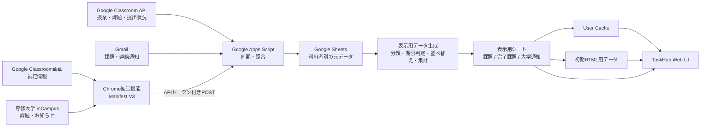

# 課題通知Hub

**TaskHub for Senshu University**

[](https://github.com/ponkichi1552/senshu-taskhub/actions/workflows/ci.yml)

Google Classroom API、Gmail、Chrome拡張機能を組み合わせ、Google Classroomと専修大学inCampusの課題・通知を一元管理するWebアプリです。

Classroomの授業・課題・本人の提出状態はGoogle Classroom APIから取得し、Gmailを15分ごとに同期して新着課題やAPIにない通知を補完します。inCampusはメール通知とChrome拡張機能から取得した情報を照合し、締切順にまとめて表示します。

同じ課題を複数の経路から取得した場合は、ID・URL・授業名・課題名などを使って照合し、一意に一致した場合だけ一つの課題として統合します。曖昧な一致では締切や完了状態を変更しません。

データは利用者ごとのGoogleスプレッドシートに保存します。同期時に表示用データまで事前生成し、通常の画面表示では利用者別キャッシュ、または準備済みの表示用シートを読む構成にしています。

個人開発を主体としたプロジェクトで、一部のUI・ホーム画面のデザインは共同で検討・制作しています。専修大学、Googleの公式サービスではありません。inCampus連携は専修大学の環境を対象としています。

## 画面例

表示データはすべて架空のサンプルです。

<table>
  <tr>
    <td></td>
    <td></td>
  </tr>
  <tr>
    <td></td>
    <td></td>
  </tr>
</table>

## 実行環境

- [TaskHubを開く](https://script.google.com/a/macros/senshu-u.jp/s/AKfycbxhoMvz2hSAAzIwWQ6YSwGWJwvzjRdDYpPxyaKQ2y9Bqigjw6YYwxSwbC6s4iHAaz4Q/exec)

> 現在は専修大学のGoogleアカウント・inCampus環境を前提としています。
> 初回利用時にはGoogleアカウントでの認証と必要な権限の許可が必要です。
> 専修大学およびGoogleの公式サービスではありません。

## 開発背景

課題や大学からの連絡はGoogle Classroom、inCampus、Gmailに分かれて届きます。

TaskHubは、Classroom APIから取得した課題と本人の提出状態を基準に一覧を作り、Gmailの通知やChrome拡張機能から得た情報を照合して、複数のシステムを行き来せずに課題・通知を確認できるようにすることを目的としています。

開発初期はGmail通知を中心に統合していましたが、実際に運用・検証する中で、Classroom APIによる構造化データ取得、Chrome拡張機能によるinCampus情報の補完、ユーザー別保存、回帰テスト、同期処理と表示処理の分離へ段階的に構成を変更しています。

## 主な機能

- Google ClassroomとinCampusの課題通知を締切の近い順に表示
- Classroom APIから授業・公開課題・本人の提出状況を1時間ごとに同期
- Gmailを15分ごとに同期し、Classroom課題メールやAPIにない通知を補足
- 手動更新ではClassroom APIの後にGmailを同期し、画面を保ったまま結果を表示
- 同じ課題をAPIとGmailの両方で取得した場合は一つにまとめ、APIの締切・提出状態とGmailの受信日時・元メールを保持
- API定期同期時に期限後14日、または期限なしで配信後21日を過ぎたClassroom課題を整理
- 課題を「今日まで」「明日まで」「今週中」「来週以降」などの期限グループに整理
- 授業別フィルター、未完了・完了済みの切り替え
- 課題の詳細表示、元の課題ページへの移動、完了状態の管理
- 新しい課題のブラウザー通知
- Chrome拡張機能を使ったClassroom・inCampus画面の補足同期
- 大学からのお知らせの検索、未読・保存済みの絞り込み
- 大学からのお知らせ一覧はタイトル・日時・本文抜粋だけを先に読み、本文は選択時に必要な1件だけ取得
- 本文をブラウザーへ全件送らず、検索時にサーバー側で全文検索
- 利用者ごとのUser Cacheを使い、再表示時のスプレッドシート読み取りを省略可能
- 初期表示する画面のデータをHTML生成時に埋め込み、初回表示用の追加RPCを削減
- 新規利用者では個人用保存先を作成し、初回データ同期を自動実行
- 架空データのテストケースと、今日・明日・今週・来週・年末年始・閏日などの仮想日時
- スマートフォン幅に対応した画面表示

## 技術スタック

| 分類 | 技術 |
| --- | --- |
| Webアプリ・サーバー処理 | Google Apps Script |
| フロントエンド | HTML、CSS、JavaScript |
| ブラウザー拡張 | Chrome Extension、Manifest V3、Chrome Extension APIs |
| Classroomの授業・課題・提出状況 | Google Classroom API |
| Gmail通知 | Gmail、GmailApp |
| ユーザー別データ保存 | Google Sheets |
| キャッシュ | Apps Script User Cache |
| 外部画面との連携 | Google Classroom、専修大学 inCampus |
| ローカルテスト | Node.js、pnpm |
| バージョン管理 | Git、GitHub |

## システム構成



## データソースの役割

TaskHubでは、Google Classroom API、Gmail、Chrome拡張機能を同じ用途で重複利用するのではなく、それぞれの特徴に合わせて役割を分けています。

| 情報 | 基準とするデータソース | 補足 |
| --- | --- | --- |
| Classroomの授業ID・課題ID | Google Classroom API | 課題照合の基準として使用 |
| Classroom課題名・説明・正式な締切 | Google Classroom API | APIから取得した現在値を基準にする |
| Classroomの提出状態・遅延・公開済み点数 | Google Classroom API | 利用者本人の提出情報のみ取得 |
| Classroom課題メールの受信日時 | Gmail | APIにはない通知時刻として保持 |
| Gmailの元メール・メッセージID | Gmail | API課題と一致した場合も削除せず保持 |
| Classroomのお知らせ・資料・返却通知 | Gmail | APIの課題一覧だけでは取得できない情報を補完 |
| APIにまだ反映されていない新着Classroom課題 | Gmail | 15分同期で先に表示し、後続のAPI同期で照合 |
| inCampus通知 | Gmail | inCampusのメール転送機能を利用 |
| inCampus課題の詳細情報 | Chrome拡張機能 | ログイン済み画面から補足情報を抽出 |

Classroom課題ではGoogle Classroom APIを基準データとし、同じ課題のGmail通知は別カードとして重複表示せず、一つの課題カードへ統合します。

Gmailは15分ごと、Classroom APIは1時間ごとに同期します。Gmailで新しい課題通知を先に取得した場合は、API同期前でも大まかな情報を表示できます。その後APIで同じ課題を取得できた場合は、APIの締切・提出状態などを優先しつつ、Gmailの受信日時・メッセージID・元メールへのリンクを保持します。

APIとGmailで一意に同じ課題と確認できない場合は、無理に統合しません。

## 保存構成

利用者ごとのGoogleスプレッドシートでは、同期元に近い正本データと、画面表示向けに事前生成したデータを分けています。

### 正本データ

- `授業`
- `Classroom課題`
- `inCampus通知`
- `提出状況`
- `補足通知`

### 表示用データ

- `課題表示データ`
- `完了課題表示データ`
- `大学通知表示データ`

表示用データは元データを置き換えるものではありません。Gmail同期、Classroom API同期、Chrome拡張機能からの更新後に再生成し、通常の画面表示で同じ解析や分類を繰り返さないために利用します。

## 設計・実装上の工夫

### Classroom APIを基準にした課題情報の統合

Classroom APIから取得した課題の締切と本人の提出状態を課題カードの基準にします。

同じ課題のGmail通知はカードに統合し、メールID・受信日時・元メールへのリンクを保持します。APIで確認できない通知や、まだAPIに現れていない課題メールは補足通知として扱います。

### 曖昧な照合では状態を変更しない

Classroom APIの授業ID・課題IDや課題URLを使って照合します。

inCampus抽出結果は授業名・課題名・レポートURLが一意に一致した時だけGmail通知と結び付けます。曖昧な一致では締切や完了状態を変更しません。

推測による誤統合より、情報を別々に残すことを優先しています。

### Classroom提出状況を授業単位で一括取得

Classroom APIから本人の提出状況を取得する際は、課題ごとにAPIを呼び出さず、課題が存在する授業ごとに一括取得します。

`courses.courseWork.studentSubmissions.list` を `courseWorkId="-"`、`userId="me"` で呼び出し、その授業に含まれる本人の提出状況をまとめて取得します。

返された各提出状況の `courseWorkId` を使ってClassroom課題と結合します。一括応答に課題IDがないデータが含まれていた場合は、タイトルなどによる推測照合を行わず、誤った課題へ提出状態を反映しないよう同期を停止します。

課題が存在しない授業については、提出状況APIを呼び出しません。

#### 実測例

2026年10月5日に、同じ実データを使って課題単位取得と授業単位一括取得を比較しました。

| 項目 | 課題単位取得 | 授業単位一括取得 |
| --- | ---: | ---: |
| 対象課題 | 39件 | 39件 |
| 提出状況API呼び出し | 39回 | 4回 |
| 提出状況取得時間 | 6,040 ms | 856 ms |
| API呼び出し削減率 | - | 89.7% |
| 取得時間短縮率 | - | 85.8% |

8授業のうち課題が存在した4授業だけ提出状況APIを呼び出しました。

新旧方式で39課題すべての提出状態などが一致することを確認したうえで、APIのみの保存同期でも39課題、提出済み19件、完了判定19件を確認しています。

API応答時間はネットワークやGoogle側の状態によって変動するため、この時間を常に保証するものではありません。同期全体には授業・課題・教員・トピックなどの取得やGoogle Sheetsへの保存時間も含まれます。

### 表示時の処理を同期時へ移動

画面表示のたびに、元メール本文の解析、期限判定、公開時刻の判定、状態別の絞り込み、期限グループ分け、並べ替え、件数集計を行うと、保存済みデータを読むだけでも表示に時間がかかります。

そのため、現在はこれらの処理をGmail同期・Classroom API同期などの更新後に実行し、画面表示向けのデータとして保存しています。

課題表示データでは、同期時に次を確定します。

- 未完了 / 完了の分類
- 公開時刻による表示可否
- 期限切れ判定
- 期限なし課題の保持期限
- 期限グループ
- グループ内の表示順
- グループごとの件数
- 授業ごとの件数

大学通知表示データでは、通知の表示期限、表示タイトル、本文抜粋などを同期時に用意します。

通常表示では、元メールやClassroom API課題一覧を再解析せず、準備済みデータを読みます。

### 初期HTMLへ表示データを埋め込む

Webアプリを直接開いた時は、初期画面に必要なデータをApps Script側で取得し、HTML生成時に初期データとして埋め込みます。

これにより、HTMLを表示した後に初期一覧取得のための追加RPCを待つ構成を避けています。

初期表示後の画面切り替えでは、利用者ごとのキャッシュを優先し、キャッシュがない場合は準備済みの表示用シートを読みます。

### 利用者別キャッシュ

課題一覧や大学通知にはApps ScriptのUser Cacheを利用します。

同期、完了状態、既読・保存状態などが変わるとキャッシュキーを更新し、古い状態のキャッシュを利用しないようにしています。

キャッシュがない場合でも、通常は元メールやClassroom APIを再処理せず、準備済み表示シートから復元します。

キャッシュの保存は画面表示を待たせないよう、表示後の処理として扱います。表示データ更新後に古い応答が返った場合は、古いキャッシュを書き戻さないよう世代・キーを確認します。

### 大学からのお知らせ本文を遅延読み込み

大学からのお知らせは、一覧表示時に全文本文をすべてブラウザーへ送信しません。

一覧では次の情報を先に読みます。

- タイトル
- 日時
- 送信元
- 授業名
- 短い本文抜粋
- 未読 / 保存状態

通知を選択した時だけ、該当する1件の本文を追加取得します。

検索では本文を検索対象に残すため、検索時だけサーバー側で全文データを利用し、該当する通知IDを返します。これにより、一覧表示の通信量とDOM生成量を抑えつつ、本文全体を対象とした検索を維持しています。

### 初回利用時の自動同期

新しい利用者では、初回アクセス時に個人用保存スプレッドシートと必要な設定を準備します。

新規保存先では初回同期が必要であることをフラグで管理し、Classroom APIとGmailの両方が正常に完了した後に初回同期完了として扱います。

Gmailの初回同期では実行時点から過去20日分を検索します。

途中で同期に失敗した場合は初回同期フラグを残し、成功していない状態を完了扱いしません。

### 通常表示とバックグラウンド保守を分離

TaskHubを開くたびに保存スプレッドシートの初期化や定期トリガーの再確認を行うと、通常の画面表示にも不要な待ち時間が発生します。

そのため、通常アクセス時の処理と保守処理を分離しています。

- 初回設定時：保存スプレッドシートと必要な構成を初期化
- 通常アクセス時：キャッシュまたは保存済み表示データの読み取りを優先
- 12時間ごと：Gmail・Classroom APIなどの定期同期トリガーを確認・修復
- 週1回：保存スプレッドシートの構成を保守

ホーム課題一覧では、Gmail由来のinCampus通知とChrome拡張機能由来の抽出データを処理する際、同じ `inCampus通知` シートを重複して読み込まず、一度取得したスナップショットを再利用します。

### 日本時間の締切と保存期間

Classroom APIの締切は日本時間へ変換して扱います。

APIから日付だけが返る場合は23:59を使用します。

Classroom課題の整理条件は次のとおりです。

- 期限あり課題：期限後14日
- 期限なし課題：配信・作成から21日後

この削除処理は1時間ごとの定期API同期で行い、手動更新や保存先スプレッドシートの作成では実行しません。

### Gmailを短い間隔で増分同期

Gmailは15分間隔で取得します。

新しく作る保存先では初回に過去20日分を取り込み、その後は保存済み受信日時を基準に新着分を検索します。

Gmail検索の `after:` は日付単位なので、取得後に正確な受信日時で再度絞り込み、メッセージIDでも重複を防ぎます。

### 同期失敗時に既存データを壊さない

Classroom APIの取得途中でエラーやタイムアウトが発生した場合は、途中まで取得できたデータで保存済みのClassroom課題一覧を置き換えません。

API同期とGmail同期は分離しており、手動更新時にClassroom API側でエラーが発生しても、可能な場合はGmail同期を続行します。

Classroom APIの課題一覧が0件になった場合も、それだけで正常な空一覧とは判断せず、取得処理が正常に完了したかを確認してから保存内容を更新します。

### 非同期更新による状態競合への対策

完了・未完了の操作中に古い一覧取得が返っても、新しい状態を上書きしにくいよう、リクエストIDや状態世代を管理しています。

表示データの更新とキャッシュ保存にも世代を持たせ、同期後の新しい状態を古い応答で巻き戻さないようにしています。

### 表示用データの安全な移行

表示用シートの形式を変更した場合は、既知の旧形式であれば新形式へ再構築します。

想定していない形式が見つかった場合は、内容を無条件に上書きせず、誤った移行で利用者データを壊さないことを優先します。

元データを正本として残しているため、表示用データは必要に応じて再生成できます。

### 同期失敗を成功扱いしない

Classroomの読み込み途中やタイムアウトを「0件の同期成功」と判定しないよう、実際の取得処理の完了状態を確認します。

大量の同期データは件数と本文サイズに応じて分割し、一部の送信失敗も結果に残します。

### ユーザー単位の保存とAPI保護

WebアプリはアクセスしているGoogleアカウントとして実行し、そのアカウントのスプレッドシートへ保存します。

Chrome拡張機能からのPOSTには利用者ごとのAPIトークンを使い、トークンをURLに含めません。

提出回答本文や提出ファイルは保存せず、公開された点数と提出状態だけを扱います。

## 大学からのお知らせの表示期間

大学からのお知らせは、元メール自体を削除せず、表示対象だけを期限に応じて整理します。

- inCampus：受信から暦で1か月が経過した通知は非表示
- Classroom：本文に日付がなければ受信から14日後に非表示
- Classroom本文に日付がある場合：検出した最も遅い日付の当日いっぱいまで表示
- 本文の日付条件は14日ルールより優先
- 年なしの日付は受信日を基準に年越しを補正
- 年月日、月日、スラッシュ・ハイフン形式、全角数字、今日・明日・明後日などを処理
- 日付が画像や添付資料にしかない場合は14日ルールを使用

表示期間を過ぎてもGmail上のメールは削除しません。

## 使用するGoogle権限

TaskHubは必要なGoogleサービスへアクセスするため、利用者本人のGoogleアカウントで権限を承認して使用します。

| 権限 | 用途 |
| --- | --- |
| `classroom.courses.readonly` | 利用者本人が参加しているClassroom授業の取得 |
| `classroom.coursework.me.readonly` | Classroom課題と本人の提出状態の取得 |
| `classroom.rosters.readonly` | Classroomの利用者・授業情報の確認 |
| `classroom.topics.readonly` | Classroom課題のトピック情報の取得 |
| `gmail.readonly` | Classroom・inCampusから届いた通知メールの読み取り |
| `spreadsheets` | 利用者ごとの保存用Googleスプレッドシートの作成・更新 |
| `script.scriptapp` | Gmail・Classroom APIの定期同期トリガーの作成・管理 |

Classroom関連の権限は読み取り専用です。TaskHubからGoogle Classroom上の課題、提出物、授業内容を変更することはありません。

Gmailも読み取り専用で利用し、メールの送信・削除・変更は行いません。

提出回答本文や提出ファイルそのものは保存せず、TaskHubで必要な課題情報、提出状態、公開済み点数などだけを保存します。

## セキュリティとデータの扱い

- 本番デプロイは「アクセスしているユーザーとして実行」し、専修大学のGoogleアカウントだけに制限する構成を想定しています。各利用者が自分のGoogle権限を承認します。
- Chrome拡張機能は、同期時にログイン済みのClassroom・inCampus画面を読み取ります。各サービスへのログインが必要です。
- `.clasp.json`、APIトークン、実際の課題・メールデータは公開リポジトリに含めません。
- テストExcelとサンプル画面は架空のデータを使い、テストリンクには `.invalid` ドメインを使います。
- 利用者ごとの既読・保存状態や設定値はUserPropertiesで管理します。
- 表示用シートは元データから再生成できる派生データとして扱います。

## 制約

- inCampus連携は専修大学の環境を対象としています。
- inCampusやGoogle Classroomの画面構造が変わると、Chrome拡張機能の抽出処理を修正する必要が生じる場合があります。
- Classroom APIは利用者本人が参加する授業と本人の提出情報を取得します。
- 拡張機能で画面情報を補う場合は、ChromeでClassroomまたはinCampusへログインしてください。
- 本プロジェクトは専修大学・Googleによる公式サービスではありません。
- Classroom APIによる課題取得が一時的に失敗した場合は、保存済みデータとGmail由来の情報を利用します。
- APIが長期間利用できない場合、一部の最新状態が反映されるまで時間がかかる場合があります。
- Apps Scriptの実行時間、User Cache、Google Sheetsの応答時間、ネットワーク状態はGoogle側の状態にも依存するため、画面表示時間や同期時間は一定ではありません。
- 大学通知の全文検索は一覧表示とは分離しているため、検索時には追加のサーバー処理が発生します。

## 設計の変遷

TaskHubは最初から現在の構成だったわけではなく、実際に利用しながらデータ取得方法と表示処理を段階的に変更しています。

### 1. Gmailによる通知統合

初期版では、Google ClassroomとinCampusの通知をGmailへ集約し、Google Apps Scriptでメールを取得・解析する方式から開始しました。

この方式により、Google ClassroomとinCampusという異なるシステムを、Gmailという共通の入力元から扱えるようにしました。

### 2. Chrome拡張機能による不足情報の補完

Gmail通知だけでは取得できない期限時刻、提出状態、inCampus課題の詳細情報を補うため、Chrome拡張機能を追加しました。

拡張機能はログイン済みのGoogle Classroom・inCampus画面を読み取り、Gmailで保存済みの通知と一意に照合できる場合だけ情報を補完します。

### 3. テスト基盤と増分同期の整備

機能追加に伴って処理量と回帰リスクが増えたため、架空データを使った回帰テスト、仮想日時、Gmailの増分同期、Apps Scriptの機能別ファイル分割を追加しました。

実際のGmailやGoogle Drive、本番スプレッドシートへ接続せず、期限境界、年末年始、閏日、重複・誤照合、完了状態などをローカルで確認できるようにしています。

### 4. Classroom APIとGmailの併用

Classroom APIが利用可能であることを検証した後、Classroom課題の基準データをGmailからClassroom APIへ移しました。

現在は、Classroom APIから授業・課題・本人の提出状態を取得し、Gmailを新着通知の早期取得とAPIにない情報の補完に利用しています。

Gmailを廃止するのではなく、

- Classroom API：正確な現在状態
- Gmail：短周期の新着通知と通知履歴
- Chrome拡張機能：画面上にしかない補足情報

という役割分担にしています。

### 5. API呼び出しの一括化

本人の提出状況を課題ごとに取得する方式から、授業ごとにまとめて取得する方式へ変更しました。

これにより、実データ39課題の比較では提出状況API呼び出しを39回から4回へ削減し、取得時間も6,040msから856msへ短縮しました。

### 6. 同期処理と表示処理の分離

表示速度を改善するため、画面を開くたびに行っていた通知解析、期限判定、分類、並べ替え、件数集計を同期時へ移しました。

現在は、元データから表示用データを事前生成し、通常表示ではキャッシュまたは準備済みシートを読みます。

### 7. 初期表示のRPC削減

初期画面のデータをHTML生成時に埋め込み、初期表示後に一覧取得RPCを待つ構成を削減しました。

画面切り替えではUser Cacheを利用し、キャッシュミス時も準備済み表示データから復元します。

### 8. 大学通知本文の遅延読み込み

大学からのお知らせは、一覧表示のために全文をすべて転送する方式から、一覧用の軽量データと詳細本文を分離する方式へ変更しました。

本文は通知選択時に1件だけ読み、全文検索は検索時にサーバー側で行います。

## ファイル構成

- [Apps Script Webアプリ本体](./taskhub-split/taskhub-split/)
- [本体ソースのworkspaceミラー](./taskhub-split/workspace/taskhub-split/)
- [Chrome拡張機能 v2.5.8](./taskhub-extension-v2.5/)
- [Gmail通知と拡張機能データの照合仕様](./taskhub-split/taskhub-split/MAIL_LINKING.md)
- [保存期間・状態管理・表示用データ生成・移行時の注意](./taskhub-split/taskhub-split/STORAGE.md)
- [Classroom API検証プロジェクトと専用テスト](./taskhub-split/classroom-api-experiment/README.md)
- [回帰テスト用Excel](./test-fixtures/TaskHub-test-cases.xlsx)
- [ローカル開発とApps Script更新手順](./local-dev/README.md)
- [拡張機能の導入・設定方法](./taskhub-extension-v2.5/README.md)
- [開発・改修履歴](./CHANGELOG.md)

Apps Scriptサーバーは `Code.gs` に共有設定と入口を置き、メール同期・通知解析・表示用データ生成・一覧処理・拡張機能連携を機能別の `.gs` ファイルに分けています。

画面側も `Scripts*.html` と `Styles*.html` に分け、`Index.html` が読み込み順を管理します。

## セットアップ概要

1. Apps Script Webアプリ本体のファイルをApps Scriptプロジェクトへ反映し、Webアプリとしてデプロイします。
2. データを利用者ごとに分ける場合は、Webアプリの実行ユーザーを「アクセスしているユーザー」に設定します。
3. Chromeで拡張機能フォルダーを「パッケージ化されていない拡張機能」として読み込みます。
4. 拡張機能に自分のWebアプリURLと、本体のセキュリティ設定で発行したAPIトークンを設定します。
5. 各自のGoogleアカウントとClassroom・inCampusへログインし、必要な権限を承認して使用します。

詳しい導入手順と対応範囲は[拡張機能README](./taskhub-extension-v2.5/README.md)を参照してください。

本番同期は利用者本人のアカウントで実行します。

- Gmail：15分ごと
- Classroom API：1時間ごと
- 同期トリガー保守：12時間ごと
- 保存構成保守：週1回

新しい保存先では初回にGmailの過去20日分とClassroom APIのデータを取得します。初回同期が途中で失敗した場合は完了フラグを残さず、次回の再試行対象にします。

通常の画面アクセスでは、GmailやClassroom APIを毎回同期するのではなく、キャッシュまたは同期済みの表示用データを利用します。

## ローカル回帰テスト

Apps Scriptの実コードとChrome拡張機能の回帰テストは、`課題hub/` で次のコマンドを実行します。

```sh
cd 課題hub
pnpm install --frozen-lockfile
pnpm test
```

テストでは、次のような境界・不具合を確認します。

- 期限区分
- 土日・週境界
- 月末・年末
- 閏日
- 日付なしや0:00の締切
- 複数課題を含むメール
- Gmailの増分同期
- 重複・誤照合
- APIとGmailの統合
- Classroom提出状況の授業単位一括取得
- ページネーション
- `courseWorkId`による課題との結合
- 課題ID欠落時のfail-closed動作
- 完了・未完了状態
- 既読・保存状態
- 設定切り替え
- 非同期更新
- 通常表示時の初期化省略
- バックグラウンド保守
- 表示用データの生成・移行
- キャッシュミス時の表示用データ読込
- 大学通知の本文遅延読込
- 大学通知の全文検索
- 一時的な読込失敗後の再試行

`test-fixtures/TaskHub-test-cases.xlsx` とテストメールの値はすべて架空で、リンクには予約済みの `.invalid` ドメインを使います。

個人の保存データ、Gmail、Google Drive、本番シートには接続せずに回帰確認できるようにしています。

`pnpm test` はApps Script本体、拡張機能、画面のオフライン回帰テストを実行します。

Excelを実際に読み込む追加スモークテストには `@oai/artifact-tool` が必要です。利用できない環境ではExcelスモークのみスキップされます。

ブラウザーでローカル画面を試す手順は[ローカル起動ガイド](./local-dev/README.md)にあります。

## 開発・改修履歴

主要な設計変更、機能追加、不具合修正、性能改善の詳細は[CHANGELOG.md](./CHANGELOG.md)に記録しています。
