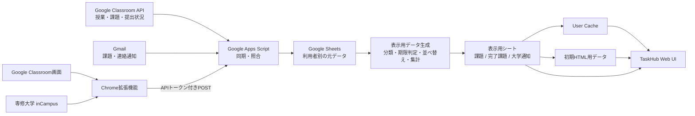

# 課題通知Hub

**TaskHub for Senshu University**

[](https://github.com/ponkichi1552/senshu-taskhub/actions/workflows/ci.yml)

Google Classroom、専修大学 inCampus、Gmail に分散している課題・通知をまとめて確認するための Web アプリです。

Classroom の授業・課題・本人の提出状態は Google Classroom API を基準に取得し、Gmail は新着通知や API にない情報の補完に利用します。inCampus はメール通知と Chrome 拡張機能から取得した情報を照合して補完します。

> [TaskHubを開く](https://script.google.com/a/macros/senshu-u.jp/s/AKfycbxhoMvz2hSAAzIwWQ6YSwGWJwvzjRdDYpPxyaKQ2y9Bqigjw6YYwxSwbC6s4iHAaz4Q/exec)

現在は専修大学の Google アカウント・inCampus 環境を対象としています。専修大学および Google の公式サービスではありません。

---

## 画面例

表示データはすべて架空のサンプルです。

<table>
  <tr>
    <td></td>
    <td></td>
  </tr>
  <tr>
    <td></td>
    <td></td>
  </tr>
</table>

## 何を解決するか

専修大学では、授業・課題・大学からの連絡が Google Classroom、inCampus、Gmail など複数の場所に分かれて届きます。

TaskHub は、それぞれを毎回確認しに行く手間と課題の見落としを減らすことを目的にしています。

主に次の情報を一つの画面へまとめます。

- Google Classroom の課題・締切・提出状態
- inCampus の課題通知と補足情報
- Classroom・inCampus から届く Gmail 通知
- 大学からのお知らせ

同じ課題を複数経路から取得した場合は、ID・URL・授業名・課題名などを使って照合し、一意に一致した場合だけ一つの課題として統合します。

曖昧な一致では締切や完了状態を変更せず、誤統合よりも情報を分けて残すことを優先しています。

## すぐに使う

### 1. Webアプリを開く

[TaskHubを開く](https://script.google.com/a/macros/senshu-u.jp/s/AKfycbxhoMvz2hSAAzIwWQ6YSwGWJwvzjRdDYpPxyaKQ2y9Bqigjw6YYwxSwbC6s4iHAaz4Q/exec)

**通常利用者が Apps Script プロジェクトを作成したり、自分でソースコードを貼り付けてデプロイしたりする必要はありません。**

### 2. 専修大学のGoogleアカウントで権限を承認する

初回利用時に、Classroom・Gmail・Google Sheets など TaskHub の動作に必要な Google 権限の承認が求められます。

Web アプリはアクセスしている利用者本人として実行し、利用者ごとの保存先を作成します。

### 3. 初回同期を待つ

初回アクセスでは、利用者ごとの保存スプレッドシートと必要な設定を自動で準備します。

その後、Classroom API と Gmail の初回同期を実行します。

- Classroom API：参加授業、課題、本人の提出状態
- Gmail：初回は過去20日分の対象通知

Classroom API と Gmail の両方が正常に完了した後に初回同期完了として扱います。途中で失敗した場合は完了扱いにせず、再試行できる状態を残します。

### 4. inCampus連携を使う場合はChrome拡張機能を追加する

Classroom の主要情報は Web アプリだけでも取得できます。

inCampus の課題詳細など、ログイン済み画面からしか取得できない情報を補完する場合は Chrome 拡張機能を使用します。

詳しい導入手順は [Chrome拡張機能README](./taskhub-extension-v2.5/README.md) を参照してください。

拡張機能には本番 Web アプリ URL と、TaskHub 本体のセキュリティ設定から発行した API トークンを登録します。

```text
https://script.google.com/a/macros/senshu-u.jp/s/AKfycbxhoMvz2hSAAzIwWQ6YSwGWJwvzjRdDYpPxyaKQ2y9Bqigjw6YYwxSwbC6s4iHAaz4Q/exec
```

## 主な機能

- Google Classroom と inCampus の課題通知を一元表示
- Classroom API から授業・公開課題・本人の提出状態を1時間ごとに同期
- Gmail を15分ごとに同期し、新着課題や API にない通知を補完
- API と Gmail で同じ課題を取得した場合は一つの課題カードへ統合
- 「今日まで」「明日まで」「今週中」「来週以降」などの期限グループ
- 授業別フィルター
- 未完了・完了済みの切り替え
- 課題詳細表示と元ページへの移動
- 新着課題のブラウザー通知
- 大学からのお知らせの検索、未読・保存済み絞り込み
- 大学通知本文の遅延読み込み
- サーバー側全文検索
- 利用者別 User Cache
- 初期表示データの HTML 埋め込み
- 利用者ごとの保存先自動作成
- スマートフォン幅対応

## データソースの役割

| 情報 | 基準とするデータソース | 役割 |
| --- | --- | --- |
| Classroom 授業ID・課題ID | Google Classroom API | 課題照合の基準 |
| Classroom 課題名・説明・正式な締切 | Google Classroom API | 現在値の基準 |
| Classroom 提出状態・遅延・公開済み点数 | Google Classroom API | 本人の提出状況 |
| Classroom 課題メールの受信日時 | Gmail | 通知時刻の保持 |
| Classroom のお知らせ・資料・返却通知 | Gmail | API 課題一覧にない情報の補完 |
| API 反映前の新着 Classroom 課題 | Gmail | 15分同期で先行表示 |
| inCampus 通知 | Gmail | inCampus メール通知の取得 |
| inCampus 課題詳細 | Chrome 拡張機能 | ログイン済み画面から補完 |

Classroom 課題は Google Classroom API を基準データとします。

Gmail で新着課題を先に取得した場合は API 同期前でも大まかな情報を表示し、その後 API で同じ課題を取得できた場合は、正式な締切・提出状態を API 側へ寄せつつ Gmail の受信日時・メッセージID・元メールへのリンクを保持します。

## 技術スタック

| 分類 | 技術 |
| --- | --- |
| Webアプリ・サーバー | Google Apps Script |
| フロントエンド | HTML、CSS、JavaScript |
| ブラウザー拡張 | Chrome Extension、Manifest V3 |
| Classroom連携 | Google Classroom API |
| Gmail連携 | Gmail、GmailApp |
| 利用者別データ保存 | Google Sheets |
| キャッシュ | Apps Script User Cache |
| ローカルテスト | Node.js、pnpm |
| CI | GitHub Actions |
| バージョン管理 | Git、GitHub |

## システム構成



## 設計・実装上のポイント

### Classroom APIを基準にした課題統合

Classroom API の課題ID・授業ID・課題URLなどを基準に照合します。

Gmail や inCampus 由来データとの一致が曖昧な場合は、推測で締切・完了状態を変更しません。

### Classroom提出状況を授業単位で一括取得

本人の提出状況を課題ごとに取得せず、課題が存在する授業ごとにまとめて取得します。

実データ39課題で比較した時は、提出状況 API 呼び出しが **39回から4回** になり、取得時間は **6,040msから856ms** へ短縮しました。

この値は特定実行時の計測結果であり、常時の性能を保証するものではありません。

### 同期と表示を分離

同期時に表示用データまで事前生成し、通常表示では次の順で読み込みます。

1. 利用者別 User Cache
2. キャッシュがなければ準備済み表示用シート

元メールや Classroom データを画面表示のたびに解析し直さない構成にしています。

### 初期表示データをHTMLへ埋め込み

最初に開く画面のデータを Apps Script が HTML を生成する時点で埋め込み、初回一覧取得用 RPC を減らしています。

### 大学通知本文を遅延読み込み

大学からのお知らせ一覧では軽量な一覧データだけを扱い、本文は通知を選択した時に該当する1件だけ取得します。

全文検索はサーバー側で実行します。

### 同期失敗時に既存データを壊さない

Classroom API の取得途中でエラーやタイムアウトが発生した場合は、途中まで取得できた一覧で保存済みデータを置き換えません。

0件の結果も、取得処理が正常に完了したことを確認してから反映します。

## 同期周期

| 処理 | 周期 |
| --- | --- |
| Gmail同期 | 15分ごと |
| Classroom API同期 | 1時間ごと |
| 同期トリガー確認・修復 | 12時間ごと |
| 保存構成保守 | 週1回 |

通常の画面アクセスでは毎回 Gmail や Classroom API へ同期せず、キャッシュまたは同期済み表示データを利用します。

## 使用するGoogle権限

| 権限 | 用途 |
| --- | --- |
| `classroom.courses.readonly` | 参加している Classroom 授業の取得 |
| `classroom.coursework.me.readonly` | Classroom 課題と本人の提出状態の取得 |
| `classroom.rosters.readonly` | Classroom の利用者・授業情報の確認 |
| `classroom.topics.readonly` | Classroom 課題のトピック情報の取得 |
| `gmail.readonly` | Classroom・inCampus 通知メールの読み取り |
| `spreadsheets` | 利用者ごとの保存用 Google スプレッドシートの作成・更新 |
| `script.scriptapp` | 定期同期トリガーの作成・管理 |

Classroom 関連と Gmail のアクセスは読み取り用途です。

TaskHub から Google Classroom 上の課題や提出物、Gmail 上のメールを変更・削除しません。

提出回答本文や提出ファイルそのものは保存せず、TaskHub で必要な課題情報、提出状態、公開済み点数などを扱います。

## セキュリティとデータの扱い

- 本番 Web アプリはアクセスしている利用者本人として実行
- 利用者ごとに保存先 Google スプレッドシートを分離
- Chrome 拡張機能からの POST は利用者ごとの API トークンで認証
- API トークンは URL に含めない
- `.clasp.json`、APIトークン、実際の課題・メールデータは公開リポジトリに含めない
- テスト用データと画面例は架空データ
- 表示用シートは元データから再生成できる派生データとして扱う

## テストとCI

ローカル回帰テストはリポジトリのルートで実行します。

```sh
pnpm install --frozen-lockfile
pnpm test
```

期限境界、年末年始、閏日、Gmail増分同期、重複・誤照合、APIとGmailの統合、Classroom提出状況の一括取得、ページネーション、fail-closed動作、完了状態、非同期更新、キャッシュ、表示データ移行、大学通知の本文遅延読み込み・全文検索などを確認します。

GitHub Actions では、push・pull request・手動実行時に固定 lockfile から依存関係を再現し、`pnpm test` を自動実行します。

CI設定は [`.github/workflows/ci.yml`](./.github/workflows/ci.yml) にあります。

`main`へのpush後は、テスト成功を条件にApps Scriptの本番デプロイが承認待ちになります。GitHubの`production`環境で承認すると、`clasp`でソースを反映し、既存のWebアプリURLを更新します。承認前のジョブには本番用認証情報を渡しません。認証は`CLASPRC_JSON`環境Secret、スクリプトIDと既存デプロイIDは`GAS_SCRIPT_ID`・`GAS_DEPLOYMENT_ID`環境変数に保存します。`.clasp.json`と認証ファイルはリポジトリへ追加しません。

## ファイル構成

- [Apps Script Webアプリ本体](./taskhub-split/taskhub-split/)
- [Chrome拡張機能 v2.5.8](./taskhub-extension-v2.5/)
- [Gmail通知と拡張機能データの照合仕様](./taskhub-split/taskhub-split/MAIL_LINKING.md)
- [保存・状態管理・表示用データ仕様](./taskhub-split/taskhub-split/STORAGE.md)
- [Classroom API検証プロジェクト](./taskhub-split/classroom-api-experiment/README.md)
- [回帰テスト用Excel](./test-fixtures/TaskHub-test-cases.xlsx)
- [ローカル開発環境](./local-dev/README.md)
- [Chrome拡張機能の導入・設定](./taskhub-extension-v2.5/README.md)
- [開発・改修履歴](./CHANGELOG.md)

## 開発者向け

通常利用者は Apps Script プロジェクトを作成・デプロイする必要はありません。

このリポジトリにある Apps Script コード、Chrome 拡張機能、テストコードは開発・検証用に公開しています。

ローカル開発、Apps Script への反映、デプロイ更新などの手順は [ローカル開発環境](./local-dev/README.md) を参照してください。

## 制約

- 現在は専修大学の環境を対象としています
- inCampus の詳細連携には Chrome 拡張機能が必要です
- inCampus や Google Classroom の画面構造変更により拡張機能側の修正が必要になる場合があります
- Classroom API や Gmail の一時的な失敗時は保存済みデータを利用します
- Apps Script、User Cache、Google Sheets、ネットワーク状態により表示・同期時間は変動します
- 本プロジェクトは専修大学・Googleによる公式サービスではありません

## 設計の変遷

1. GmailによるClassroom・inCampus通知の統合
2. Chrome拡張機能による不足情報の補完
3. 回帰テスト・仮想日時・Gmail増分同期の整備
4. Classroom APIを課題情報の基準データへ変更
5. Classroom提出状況取得を課題単位から授業単位へ一括化
6. 同期時に表示用データを事前生成
7. 初期表示データをHTMLへ埋め込み
8. 大学通知本文を一覧から分離し、選択時だけ遅延読み込み
9. GitHub Actionsによる回帰テスト自動実行

各変更の詳細、検証内容、性能測定、不具合修正は [CHANGELOG.md](./CHANGELOG.md) に記録しています。
